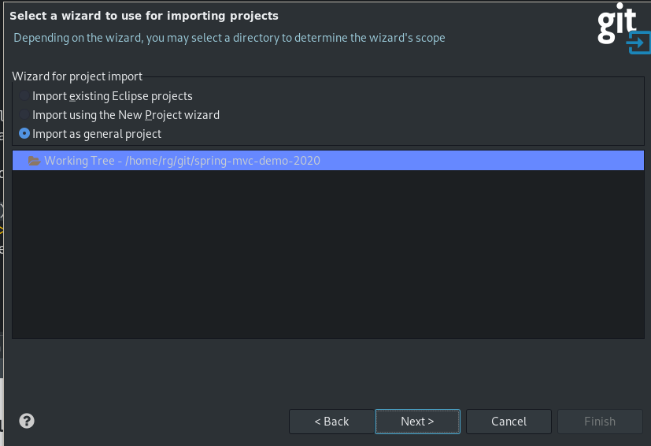
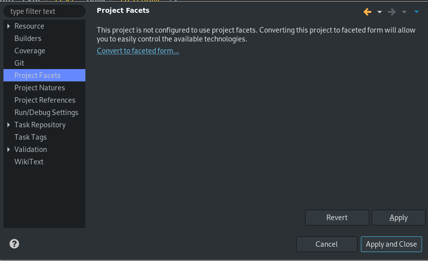
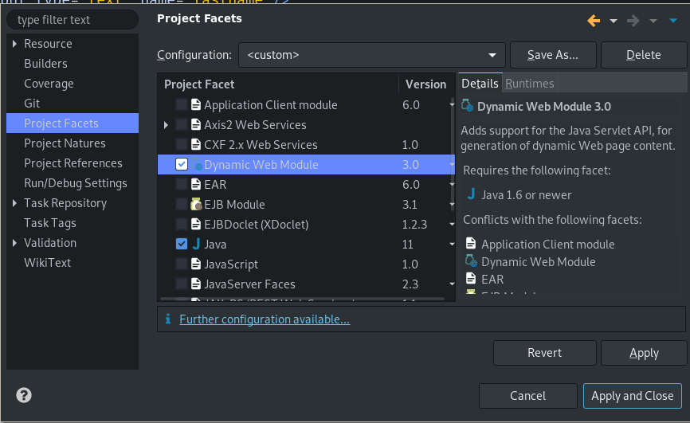
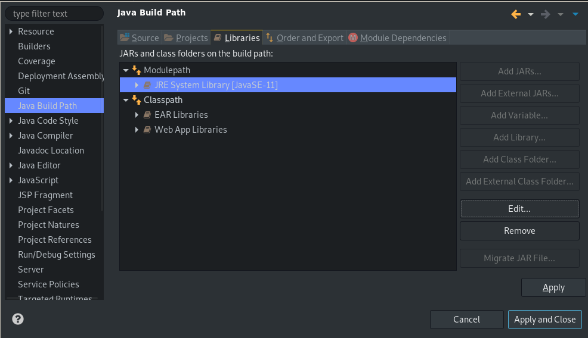
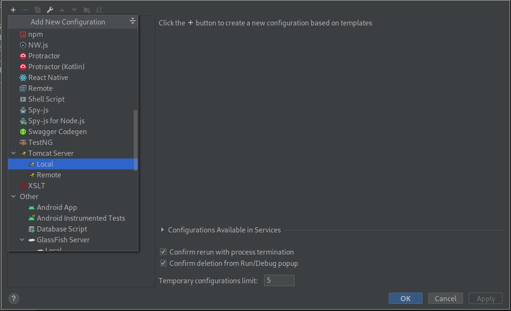
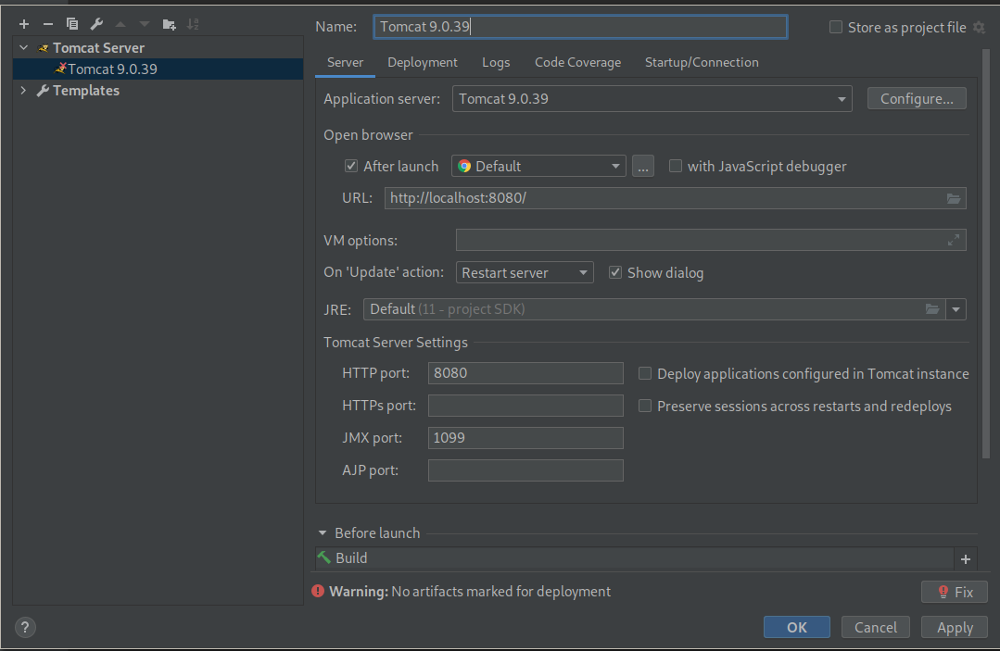
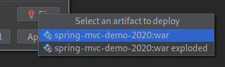
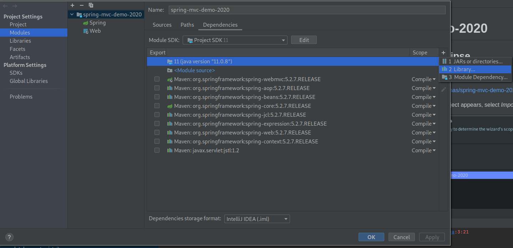
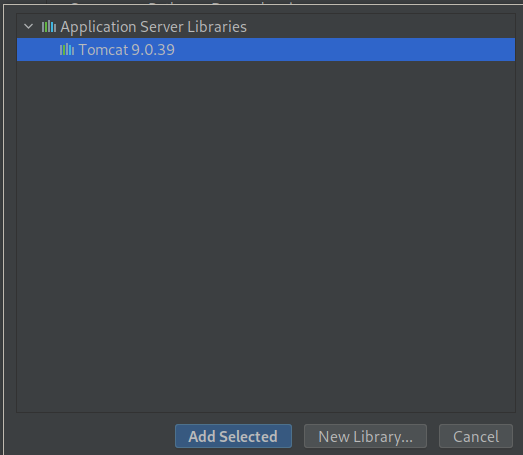

## Clone Project into Eclipse

File -> Import -> Git/Projects from Git -> Clone URI

the project url is
[https://github.com/tsadimas/spring-demo-2021.git](https://github.com/tsadimas/spring-demo-2021.git)

when the prompt to select the kind of project appears, select *Import as general project*

Next, you should convert the current project to Dynamic Web project.
To accomplish this, you should right-click the project and in properties go to *Project Facets*
Enable Faceted Project

and select _Dynamic Web Module_ from the facets list.

Set the default JRE runtime to be Java 11. To accomplish this, right click the project and in _Java Build Path_, in Libraries Tab edit the _JRE System Library_ to point to your Java 11 runtime (setting the appropriate value to Alternate JRE).

To fix the errors in jsp files, you should again right click the project, and in properties go to _Targeted Runtimes_ and select the Apache Tomcat that is connected to your eclipse workspace.

Also, don't forget to convert the project to maven project (Configure->Convert to Maven Project) and select Maven--> Update Project from the menu appearing when right-clicking the project.

## Clone Project in IntelliJ

### Configure IntelliJ to use local Tomcat

Select Run &rarr; Edit Configurations, Then the plus (+) symbol and select Tomcat Server &rarr; Local.

Set the location and then press the "fix" button

and select an artifact to deploy.

### Fix ``cannot resolve import javax.servlet.*``

Go to File &rarr; Project Structure
Select Modules &rarr; [your module name] &rarr; Dependencies and click the plus symbol (+)

and select "Application Server Libraries &rarr; Tomcat X.X.X"

## Links
* [Maven]: [Setting the -source and -target of the Java Compiler](https://maven.apache.org/plugins/maven-compiler-plugin/examples/set-compiler-source-and-target.html)
* [IntelliJ]: [Error:java: release version 5 not supported](https://dev.to/techgirl1908/intellij-error-java-release-version-5-not-supported-376)
* [IntelliJ]: [IntelliJ IDEA cannot resolve import javax.servlet.*;](https://stackoverflow.com/questions/25589152/intellij-idea-cannot-resolve-import-javax-servlet)
* [IntelliJ]: [How to add Resources Folder, Properties at Runtime into IntelliJ classpath? Adding Property files to Classpath](https://crunchify.com/how-to-add-resources-folder-properties-at-runtime-into-intellijs-classpath-adding-property-files-to-classpath/)
* [git]: [What is git tag, How to create tags & How to checkout git remote tag(s)](https://stackoverflow.com/questions/35979642/what-is-git-tag-how-to-create-tags-how-to-checkout-git-remote-tags)
